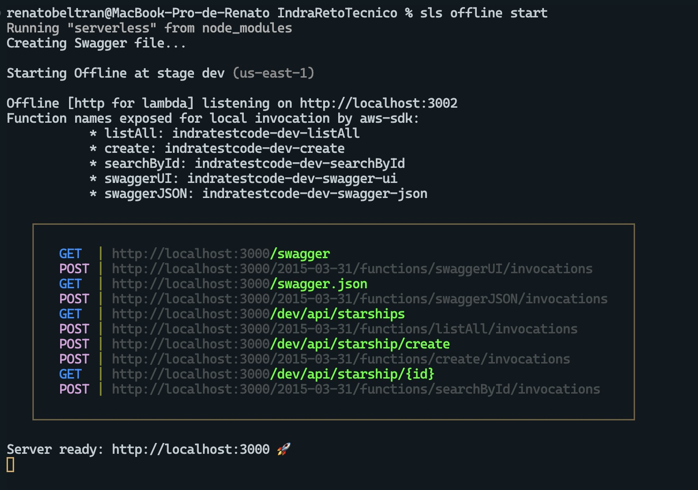
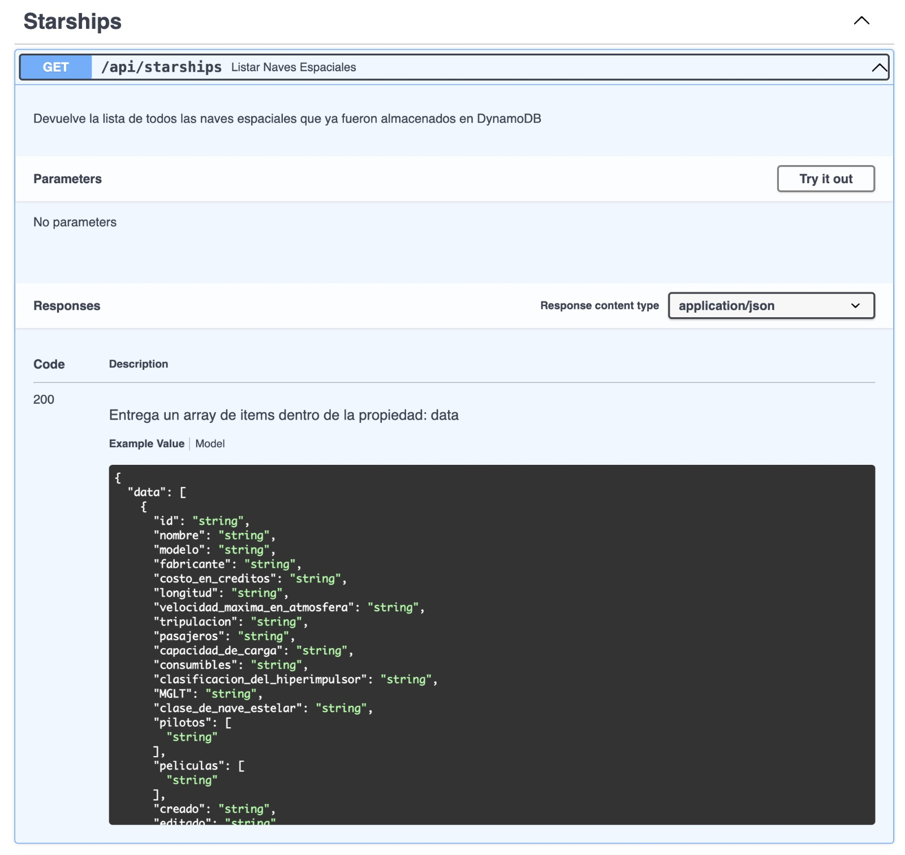
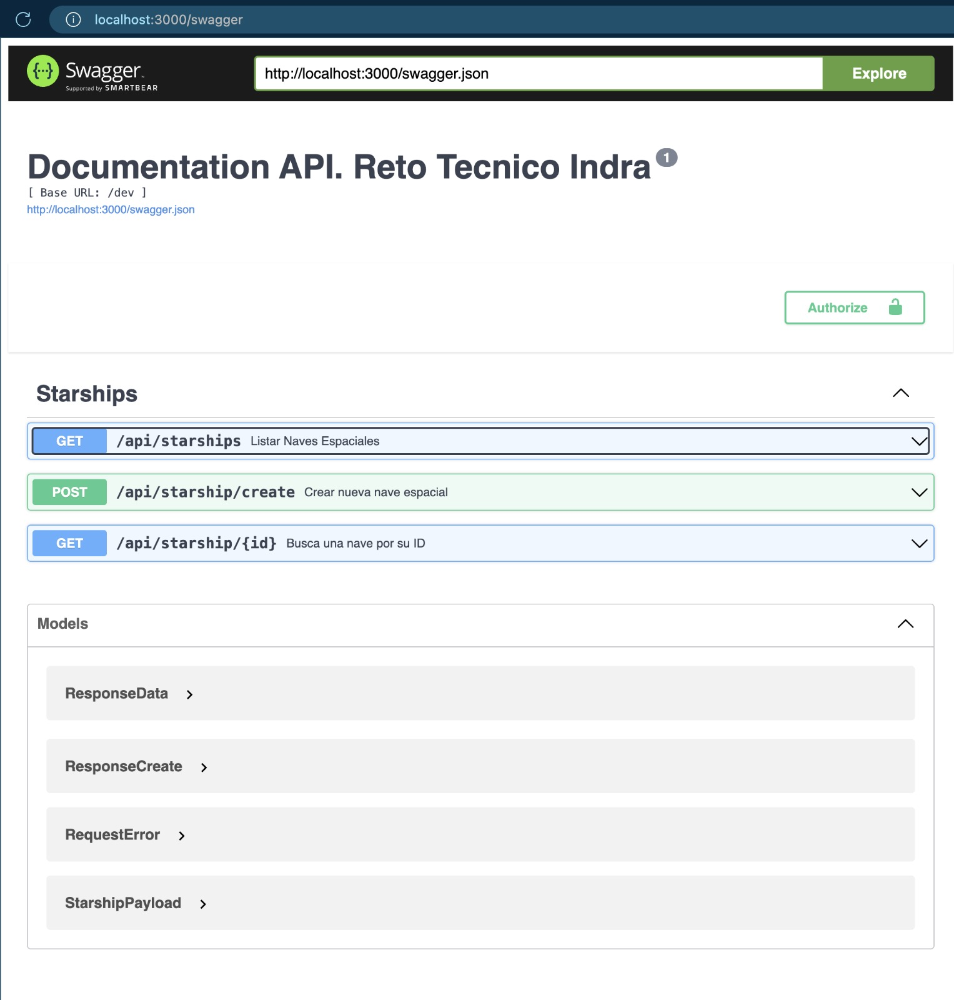
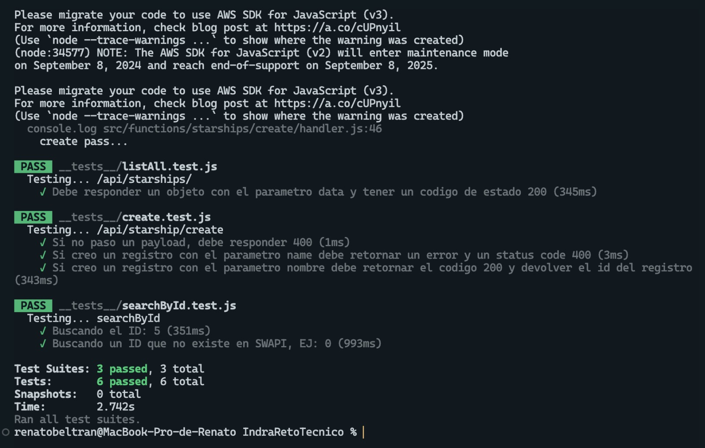

# Serverless - AWS Node.js Typescript DynamoDB & SWAPI

Reto Técnico Backend que involucra la implementación de Serverless con AWS en Node JS, conectado a una base de datos
Dynamic DB para guardar la información que proviene desde el endpoint de SWAPI.

## Instrucciones de instalación y despliegue

1. Clonar el repositorio
2. Instalar las dependencias

### Usando NPM
> **Requerimientos**: NodeJS `lts/fermium (v.14.15.0)` en adelante. 
> AWS-CLI, Serverless
> Usa tus credenciales para iniciar sesión en tu cuenta usando AWS-CLI

- Ejecuta `npm i` para instalar las dependencias del proyecto
- Ejecuta `sls deploy --verbose` para desplegar el stack en AWS (es necesario haber configurado el CLI)
- Para probar localmente ejecuta: `sls offline start`

## Endpoints disponibles
#### Endpoints:
  GET - http://localhost:3000/dev/api/starships
  GET - http://localhost:3000/dev/starship/{id}
  POST - http://localhost:3000/dev/starship/create

#### Documentación de Swagger:
  GET - http://localhost:3000/swagger
  
## Pruebas unitarias
- Para correr las pruebas unitarias ejecutar: `npx jest`

